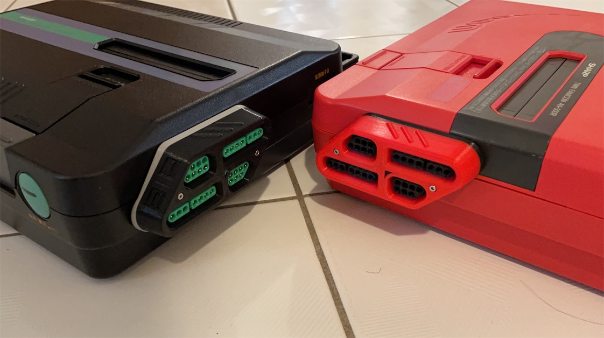
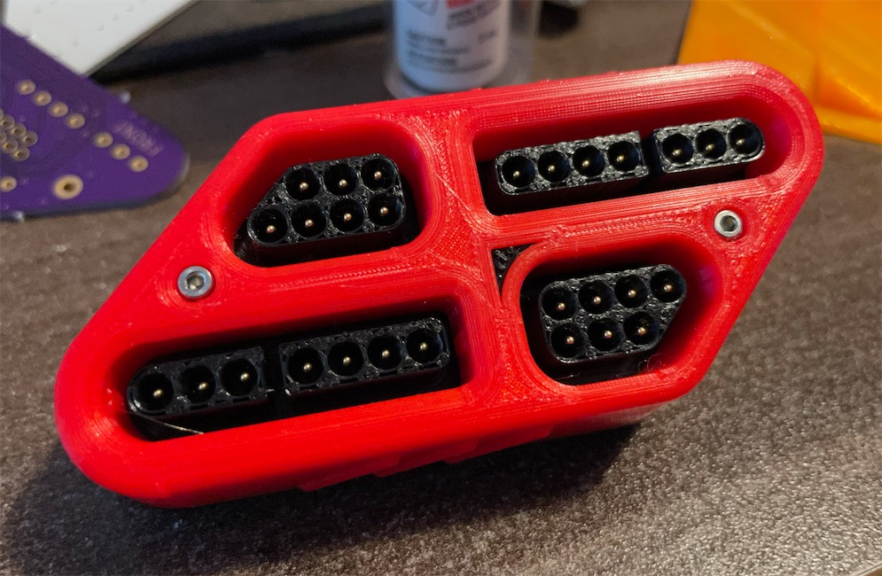
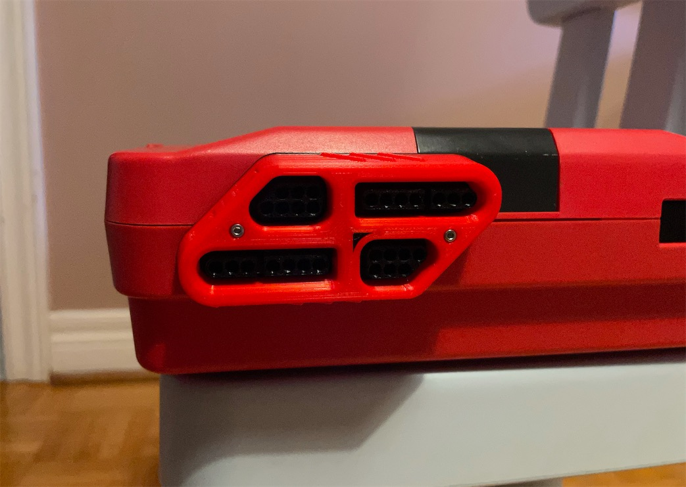
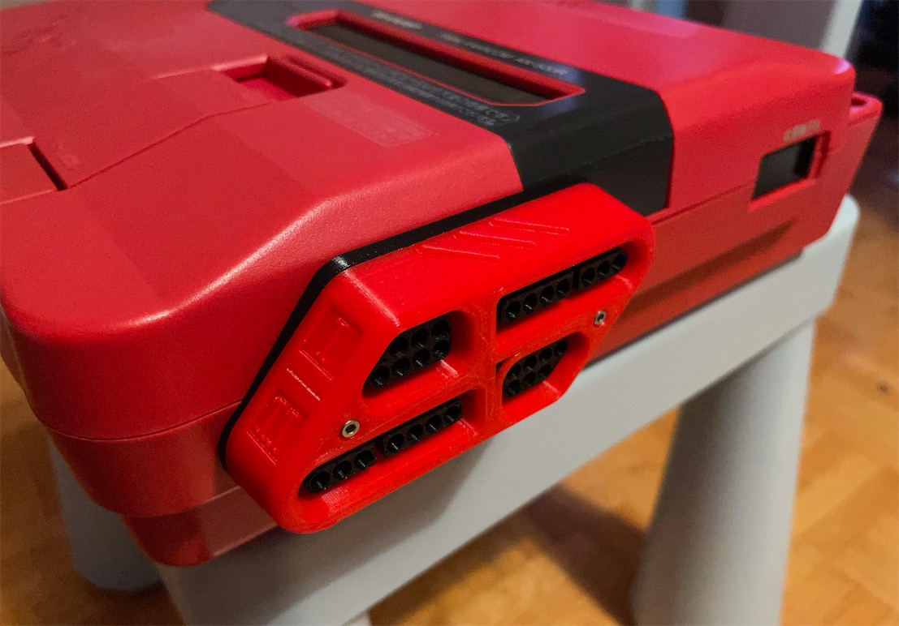
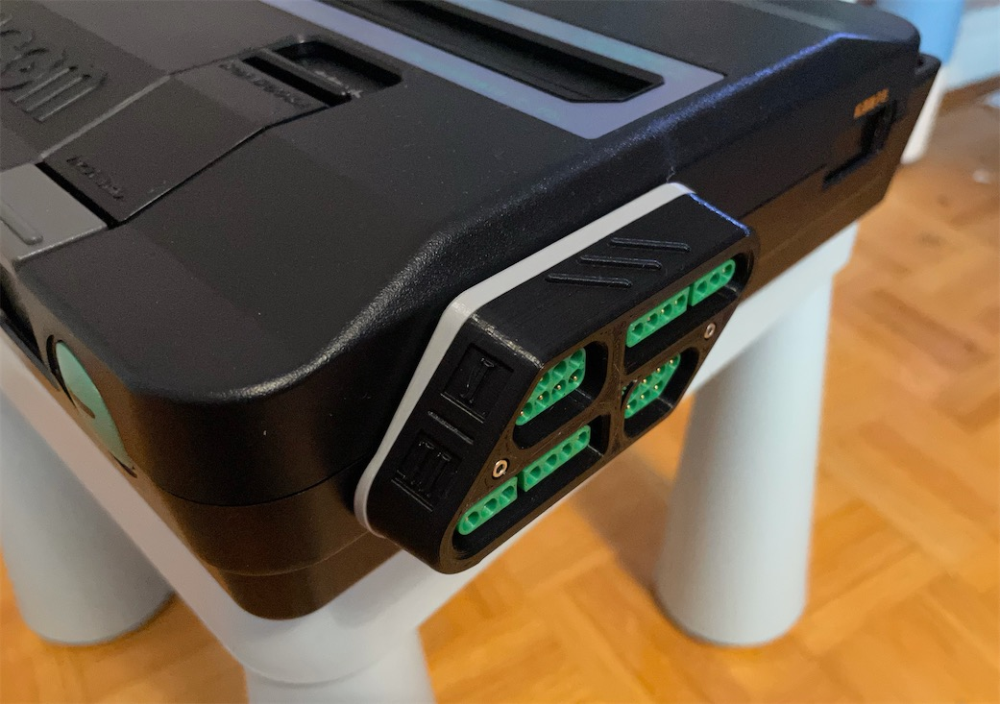
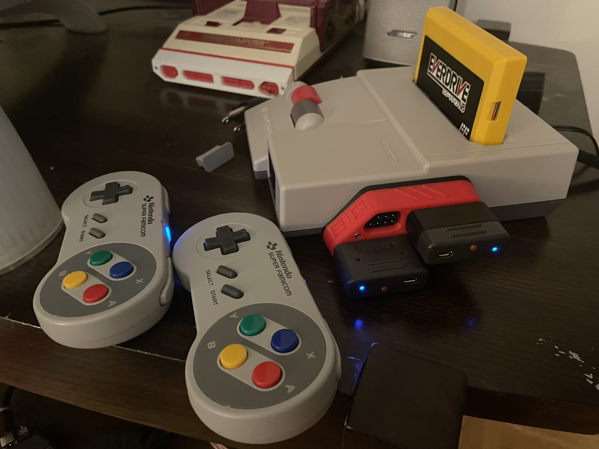
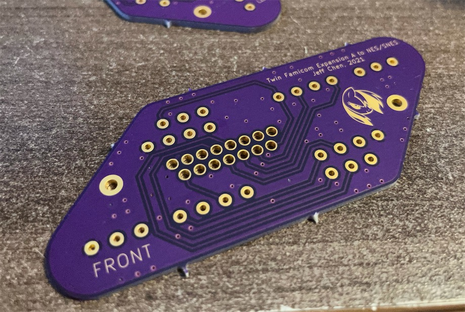
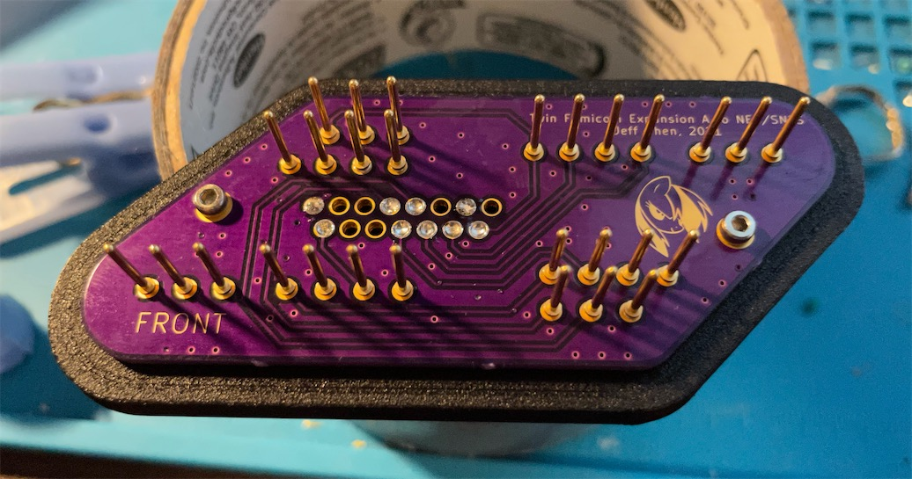
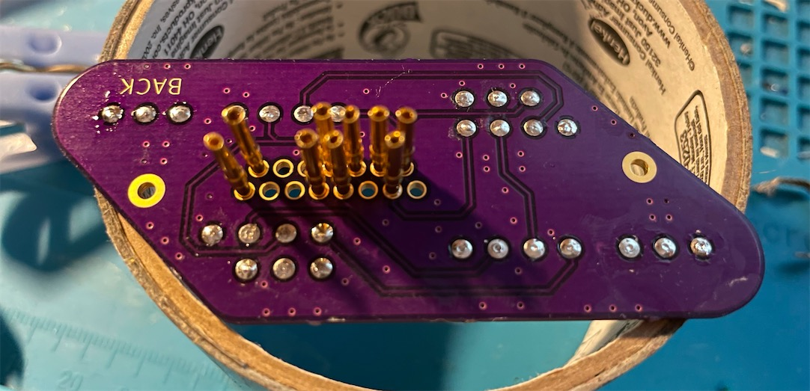

# TwinDiamond - Twin Famicom Expansion A to NES/SNES Controller Adapter

This is an adapter for the Nintendo Twin Famicom expansion port A. It is compatible with NES and SNES controllers, plus the NES Zapper lightgun with the 2P NES port.

This adapter also fits well onto the AV Famicom.

Note that due to the way different games are coded, some games can't read the controllers connected on the expansion port (mostly non-Japanese games, designed for the NES).

-----------

## Parts

- [PCB](https://oshpark.com/shared_projects/1aCic7tG)

- [22x or 28x] Front Pins - Terminal Pins, Male, Machined - [Link](https://github.com/jeffqchen/JeffParts/blob/main/Connectors/Terminal%20Pins/Machined%20Male/info.md)

- [9x] Back Pins - Terminal Pins, Female, Machined - [Link](https://github.com/jeffqchen/JeffParts/blob/main/Connectors/Terminal%20Pins/Machined%20Female/info.md)

- [2x] M2x16mm Hex Screw & Nut - [Link](https://github.com/jeffqchen/JeffParts/blob/main/Parts/M2%20M3%20Hex%20Screw%20%26%20Nut/info.md)

3D Printed Shells

-----------

## Printing

Print everything facing up is a good choice. There really isn't much to it.

The front jacket obviously needs supports.

The plug part might appear split if your line width is set too big. Try 0.35mm and enable "print thin walls" in your slicer. Don't use supports on the the plug. Make sure you don't have too much over-extrusion for the bottom layers as it may clog the holes for the pins. Try an NES plug with the plug part. If they don't go in, clear the NES port holes with a 9/64" drill bit, usually only around the orifice.

The back part doesn't need support either.

-----------

## Assembly

Soldering is not too hard but requires attention. You may want to plug in a controller into the printed plug first, insert the pins in from the back of the printed piece, one port at a time, then fit the PCB over the stumps and solder. Use just enough amount of the solder. Make sure nothing protrudes too much up from the surface.

Repeat the same thing for the back female pins. Fit the 9 pins inside the back piece and then solder them in with small amount of solder.

Note you don't have to populate all the pins, but it makes it look better.

Put the plugs part over the front side through the pins, then seat the assembly into the front jacket piece.

Finally, close it up with the back piece and secure with two sets of M2x16mm screws and nuts.

-----------

## Misc
Thingiverse Page:  
- https://www.thingiverse.com/thing:4882800

-----------

## Special Thanks

Chris Kempson:  
- http://chriskempson.com/posts/nes-controller-to-famicom-adapter/

NesDev Wiki:  
- https://wiki.nesdev.com  

Mike Chi (creator of the very famous RetroTink)  
- https://www.retrotink.com
